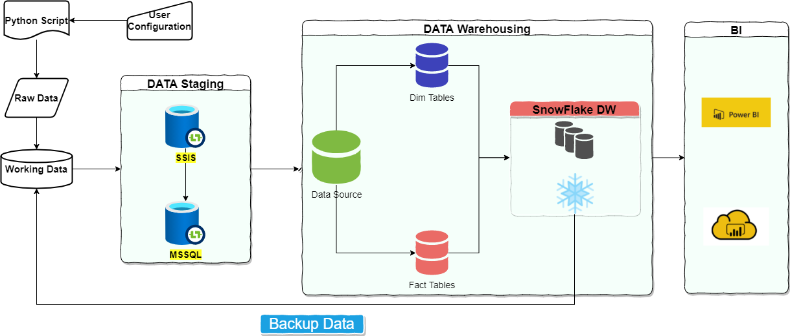
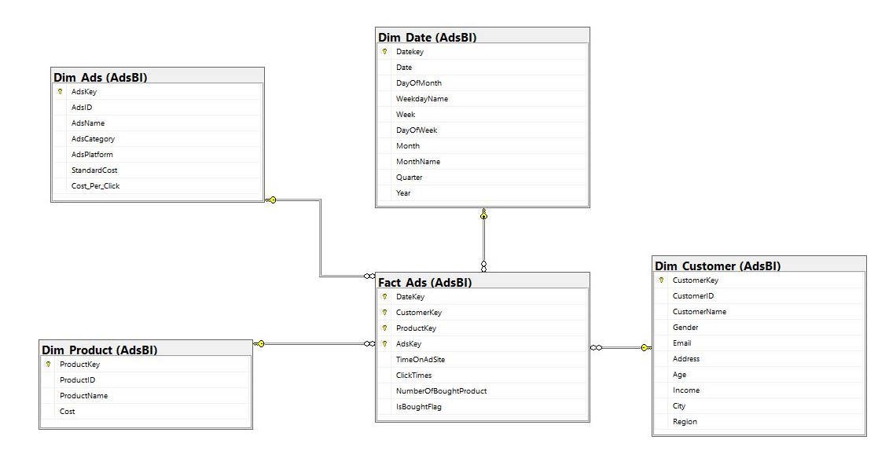

# PROJECT FA 01 

## I. DECSRIPTION OF THIS PROJECT

**Business Question:** 
*Social Media- User behavior analysis (based on engagement, content, user's personnal information…) to maximize advertisement income*

***Prototype Solution***: Analysis of the parameters that influence the Ads Income such as: Platform, Ads Categories, .etc. In this report scope, the Ads income includes Standard cost for the Product advertised and the total cost per click charged on user/customer click on Ads.

This project is for initializing and creating data pipeline to answer the aboved Bussiness Question.

## WORKING DATA

Data is generated based on Python sript. The database (.csv flat files) will include:

1. CustomerData.csv

    This file includes basics data for a customer such as Customer_ID, Full_Name, Gender, Email,.ect. The list of customer ID is temporary saved in during the generating process.

2. ProductData.csv

    This file includes basics data for a product such as Product_ID, Product_Name, Product_Category, Cost,.ect. The list of product ID is temporary saved in during the generating process.

3. AdsHeaderData.csv

    This file includes basics data for a product such as Ads_ID, Ads_Name, Ads_Category, Platform,.ect. The list of advertisement ID is temporary saved in during the generating process.

4. AdsDetailData.csv

    This file contains trasaction information with the components:
        - Date: Indicates the date of record.
        - Customer_ID: this is ramdomly select from the customer ID list saved aboved to ensure that the data exist in      CustomerData.
        - Product_ID: this is ramdomly select from the product ID list saved aboved to ensure that the data exist in        ProductData.
        - Time_Spent_On_Ads: Average time user/customer spent on a specific Ads for a specific product, unit is minute.
        - Ads_ID: this is ramdomly select from the Advertisement ID list saved aboved to ensure that the data exist in      AdsHeaderData.
        - Daily_Internet_Usage: Average time user/customer spent for the Internet, unit is hour.
        - Number_ClicksAds: Total of clicks user/customer clicked on the Ad.
        - Number_ProductBought: Total number of product user/customer actually bought from the Ad.

**Each of the csv file includes *Modified_Date* to indicate the date Data is created.**

Please note that the Data will be replaced each time the python script is executed. User is highly recommended to change the variable *start_date* and *end_date* in config file to update the data chronologically.

## DETAIL OF WORK

0. Generate Data
    - [x] Generate rawdata and copy to $path/Working-Folder
1. Design data pipeline 
    - [x] Create Drawio file
2. Build data model 
    - [x] Generate Dim/Facts Tables scheme
3. Ingest data from flat file csv
    - [x] Data Profiling and Data Staging 
    - [x] Build a SSIS solution to do ETL and stage data in MSSQL
    - [x] Deploy package into MSSQL 
    - [ ] Error Handling   
4. Load data onto SNOWFLAKE and do DataWarehousing
5. Visualize your data using PowerBI
6. Update data 

## HOW TO SETUP
1. Login into MSSQL and run [init_mssql.sql](./src/mssql/init_mssql.sql)
2. Open SSIS solution:
    - Update *ConnectServer.DB* to with your servername
    - Change variable *DirPath* with your *$your-path/Working-Folder*
    - Change variable *ErrorPath* with your *$your-path* that you want to log error in ETL staging process.
3. Authen SnowSQL and run [init_snowflake.sql](./src/snowflake/init_snowfalke.sql)
4. Configure your [config.json](./resources/python_source/config.json) then generate data [main_gen.py](./resources/python_source/main_gen.py)

*** Configuration for generating data ***

    User should follow the format of config.json to update the data based on one's purpose.